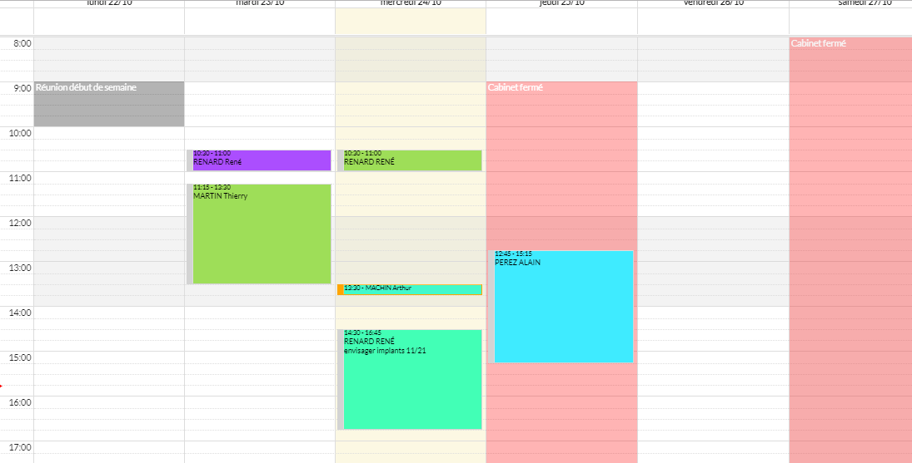
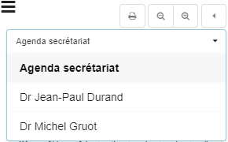
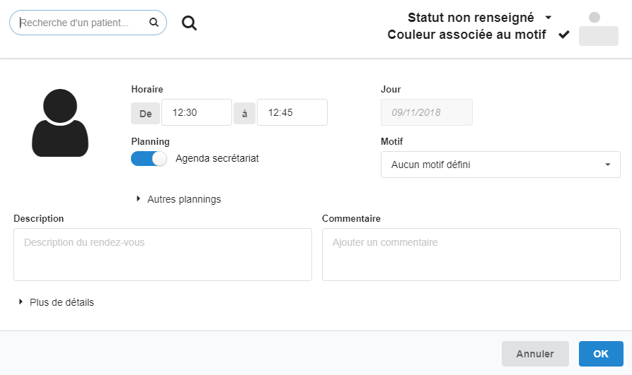
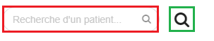
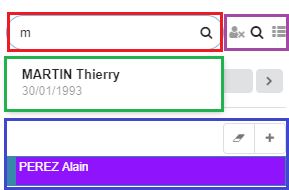

# AGENDA

Le menu **Agenda** permettra au praticien de visualiser ses rendez-vous sur un mois, une semaine ou un jour. Les rendez-vous peuvent avoir été créés à partir de l'agenda ou bien en ligne.

Sur cet agenda, il peut y avoir plusieurs plannings et un rendez-vous peut figurer sur plusieurs plannings à la fois.

## Changement de planning 

## Impression de l'agenda

Cliquer sur l'icône d'impression : 

## Création d'un nouveau rendez-vous

En cliquant sur un créneau horaire, une interface de saisie d'information du rendez-vous est ouverte.

* Le nom et le prénom du patient : voir l'image de la recherche d'un patient

* les plannings sur lesquels ce rendez-vous figurera et les motifs du rendez-vous sur différents plannings

* La couleur du rendez-vous sur l'agenda

* Le statut du rendez-vous : Les valeurs possibles pour ce champ sont **_Statut non renseigné_**, **_Présence à l'heure_**, **_Retard_**, **_Retard important_**, **_RDV annulé dernier moment_** et **_Absence_**

* La date et l'heure du rendez-vous correspondent au créneau sélectionné sur l'agenda mais ces informations peuvent toute fois être modifiées manuellement à partir de cette interface

* La description et le commentaire du rendez-vous

* Dans la rubrique "**_Plus de détails_**" on y trouve des informations sur le créateur, la date de création et la date de la dernière modification du rendez-vous. On y trouve aussi les options de rappel du rendez-vous par SMS _si un numéro de téléphone portable est renseigné pour ce patient_.

A la fin de la création d'un rendez-vous, le click sur le bouton "**OK**" correspond à l'enregistrement du rendez-vous et ce dernier sera visible sur l'agenda au bon créneau horaire.

## Annulation et suppréssion d'un rendez-vous

Ces deux actions sont faites à partir de l'interface de la visualisation du détail d'un rendez-vous. C'est l'interface qui s'ouvre quand on clique sur un rendez-vous dans l'agenda. 

Le clique sur le bouton "**Supprimer**" ouvrira une fenêtre de dialogue avec trois options : **Retour**, **Marquer annulé** et **Supprimers**.

* **Retour** correspond à l'annulation de l'action

* **Marquer annulé** marquera le rendez-vous comme annulé. Ce rendez-vous ne sera plus visible sur l'agenda mais sera toujours présente dans la base de données et fera partie de la liste des rendez-vous si le praticien veut l'historique des rendez-vous de ce patient

* **Supprimer** : Suppréssion définitive du rendez-vous.

## Mise en attente d'un rendez-vous

Sur l'agenda, il faut d'abord faire une recherche d'un patient et une fois le patient sélectionné, appuyer sur l'icône "**+**". Le rendez-vous est créé et est mis en attente. Pour pouvoir le placer dans sur un créneau, il faut juste le glisser dessus. 

* En **_Rouge_** c'est la barre de recherche des patients et en **_Vert_** c'est la liste des patients dont les préfixes de leurs dénominations correspondent à ce qui vient d'être saisi par le praticien

* En **_Bleu_** c'est la liste des rendez-vous qui sont en attente. Il y a aussi deux icônes, l'une c'est pour vider cette liste et l'autre c'est pour ajouter un rendez-vous à cette liste; icône "**+**"

* En **_Violet_** nous avons deux icônes qui sont actives dès qu'un patient est sélectionné dans la liste des suggestions : une pour nettoyer la barre de recherche et l'autre pour afficher la liste des rendez-vous du patient sélectionné.

## Liste des rendez-vous d'un patient

Pour accéder à la liste des rendez-vous d'un patient ainsi qu'aux autres fonctionnalités telles que :

* la **_Confirmation SMS_** d'un rendez-vous

* l'**_Impression d'une carte de Rendez-vous_**

* l'**_Historique des rendez-vous_** du patient

* la **_Génération manuelle d'un nouveau mot de passe_** pour la prise de rendez-vous en ligne

Il y a deux possibilités à partir de l'agenda : 

* Faire une recherche d'un patient dans la barre de recherche et cliquer sur l'icône permettant d'accéder à la liste des rendez-vous de ce patient

* Ouvrir un rendez-vous sur l'agenda et cliquer sur le bouton "**Tous les rendez-vous**"