# rhapi-rdv
Une application de gestion de RDV pour RHAPI

La configuration des agendas se fait depuis le menu Configuration du site : 

Dans cette page, plusieurs options sont disponibles.

Tout d’abord, il est possible de définir un nom pour le planning. 
Pour cela, il suffit de le saisir dans le champ « Titre » :

On pourra également ajouter une description au Planning ainsi qu'une couleur par défaut pour les rendez-vous.

Toute modification effectuée dans le menu de configuration devra être enregistrée via le bouton "Sauvegarder" en bas de page.

# Utilisateurs et droits d'accès

Cette rubrique permet de définir les propriétaires et l'administrateur du planning sélectionné.

L'administrateur est unique et il ne peut donc y en avoir qu'un.
C'est lui qui définit quels sont les propriétaires d'un agenda. C'est à dire ceux ayant la possibilité d'accéder au planning et de pouvoir gérer celui-ci.
L'administrateur peut ajouter autant de propriétaires qu'il le souhaite en passant par le menu de configuration.
Pour ajouter un nouveau propriétaire, il suffit de saisir son nom dans la liste. 
Au cas où il y aurait plusieurs propriétaires, il faudra séparer chaque propriétaire par un espace.

Exemple : 

Il est cependant possible de changer d'administrateur à tout moment.
Pour transférer les droits d'administration à un autre utilisateur, il suffit de saisir son nom dans le champ "Transfert des droits administrateur" et de cliquer ensuite sur "Transférer" ou "Sauvegarder" :

A partir de là, l'utilisateur indiqué dans "Transfert des droits administrateur" verra sur sa page un bouton "Transférer un planning :

Il n'aura donc plus qu'à cliquer sur ce bouton (qui lui demandera ensuite de confirmer ou non la prise de droits) pour devenir le nouvel administrateur :

Enfin, le message suivant apparaitra pour confirmer la réussite du transfert de droits :

Tant que la personne à qui les droits sont transférés n'a pas confirmer la récupération des droits administrateurs, c'est celui qui a initié le transfert qui restera administrateur. 
Cela dans le but d'éviter de perdre les droits administrateur en cas d'erreur dans le nom saisi pour le transfert. 

# Plages horaires d'ouverture

Ce menu permet la configuration complète des plages d'ouverture du cabinet.

Trois paramètres sont modifiables, indépendament des journées :
La "Durée par défaut d'un RDV", qui correspond au temps par défaut pour le créneau d'un nouveau rendez-vous, et la "Durée minimale d'un RDV", qui correspond à la durée visible des créneaux horaires dans l'agenda.
Le troisième paramètre est la couleur, qui sera ainsi la couleur par défaut des rendez-vous.

Une fois ces paramètres saisis, il est possible de configurer les plages horaires d'ouverture soit pour la semaine entière directement, soit journée par journée.

Pour la partie semaine :
à compléter.

Pour configurer journée par journée, il suffit de cliquer sur le jour souhaité puis de cliquer sur le bouton "+", afin de définir les plages horaires souhaitées.
Il est par exemple possible d'ouvrir le lundi, de 9h à 12h et de 14h à 18h :

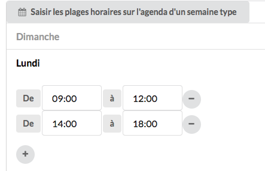

Pour supprimer une plage horaire, il faut simplement cliquer sur le bouton "-" en bout de ligne.

Une fois toutes les plages configurées, il ne reste plus qu'à tout valider via le bouton "Sauvegarder" en bas de page.

# Evènements récurrents

Il est possible de créer des évenènements récurrents qui apparaitront ensuite dans le planning et qui permettront d'indiquer ce qu'on a prévu de faire à tel jour et tel créneau horaire.
Pour créer un évènement récurrent, il suffit de cliquer sur le bouton "+ Ajouter un évènement" :

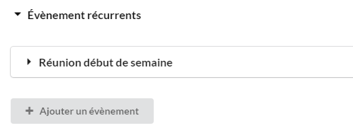

Il faut ensuite donner un nom à l'évènement, lui choisir une couleur et indiquer si cette couleur apparaitra en arrière plan ou non.
Arrière plan signifie que la couleur sera beaucoup plus transparente. Sans l'option arrière plan, la couleur sera de la même intensité que celles des rendez-vous.

Exemple sans l'option arrière plan :

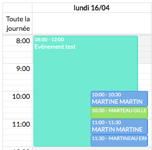

Exemple avec l'option arrière plan :

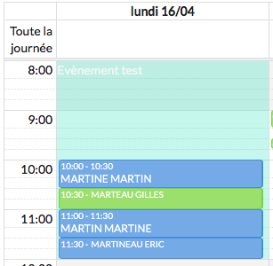

Une fois ces paramètres validés, il faut maintenant indiquer les créneaux horaires concernés par l'évènement.
Le fonctionnement est le même que pour les plages horaires d'ouverture : on sélectionne une journée, on clique sur le bouton "+" et on mentionne le créneau horaire souhaité.

Exemple : 

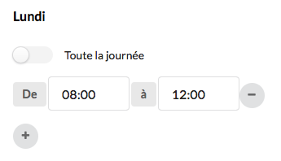

Toutefois, il est possible d'indiquer qu'un évnèement s'applique à une journée entière plutôt qu'un créneau horaire.
Pour cela, il faut cocher l'option "Toute la journée" :

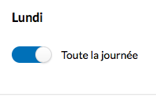

L'évènement récurrent s'affichera ainsi dans la zone "Toute la journée" de l'agenda :

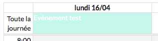

# Prise de rendez-vous

La gestion des congés, des niveaux d'autorisation pour la prise des rendez-vous ainsi que la gestion des motifs de rendez-vous se fait via ce menu.
Ici, on peut définir le délai maximum, en jours, pour la prise d'un rendez-vous ainsi que le délai de prévenance, en heures, pour leur annulation.
On peut également définir le format des noms affichés dans l'agenda, comme NOM/PRENOM, NOM/Prénom, Nom/Prénom, etc... et indiquer la dénomination d'un rendez-vous par défaut pour les patients non identifiés :

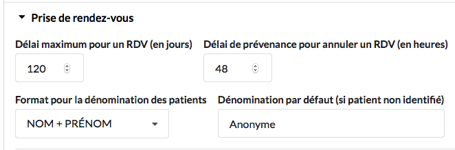

## Congés

Tout d'abord, il est possible d'activer, ou non, l'affichage des jours fériés légaux dans l'agenda.
Si on souhaite les afficher, il suffit de cocher la case "Les jours fériés légaux sont pris en compte automatiquement" :

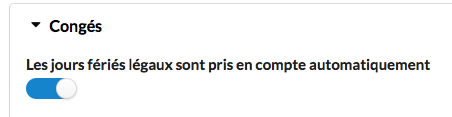

Pour obtenir le résultat suivant :

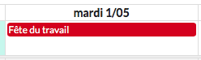

Ensuite, on indique si on souhaite afficher les congés dans l'agenda, la couleur de ceux-ci et enfin les dates concernées.
Là encore, on clique sur le bouton "+" pour ajouter une plage de dates, on saisit ensuite les dates et enfin son intitulé :

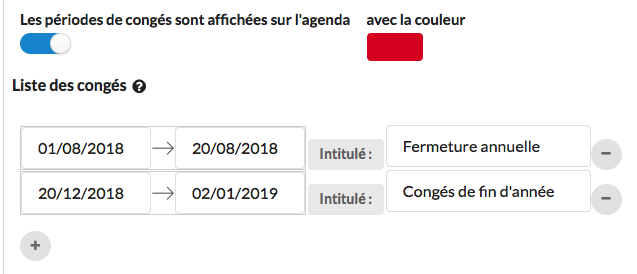

## Niveaux d'autorisation

Les niveaux d'autorisation, qui vont de 0 à 3, permettent de définir ce qu'un patient ou un correspondant peut faire au niveau du planning.
Par exemple, si le patient A peut prendre des rendez-vous quand il le souhaite, ou bien uniquement pour certains motifs, ou encore certains créneaux horaires uniquement.
Avant de pouvoir indiquer ce qu'un patient ou un correspondant peut faire, il faut donc commencer par définir ce qu'il est possible de faire selon chaque niveau d'autorisation.

Le "Niveau minimum d'autorisation requis pour la prise de RDV en ligne" permet de savoir à partir de quel niveau on peut accéder aux rendez-vous en ligne :

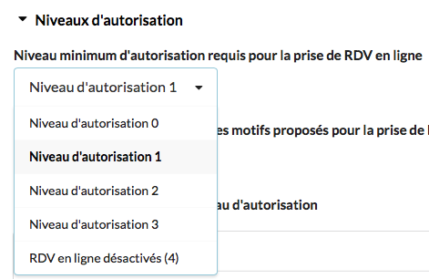

Il est possible de désactiver cette fonctionnalité en sélectionnant la ligne "RDV en ligne désactivés (4)".

Le "Niveau maximum accepté pour un RDV en ligne" permet cette fois d'indiquer le niveau maximum autorisé (A REVOIR)

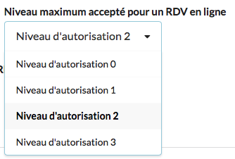

Le "Niveau d'autorisation minimum des motifs proposés pour la prise de RDV depuis l'agenda" sert à définir à partir de quel niveau on peut sélectionner un motif lors de notre prise de rendez-vous en ligne.

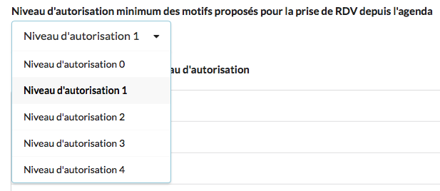

Enfin, les "Plages horaires ouvertes par niveau d'autorisation" sont à définir de la même manière que les plages horaires classiques.
Il faut d'abord sélectionner le niveau d'autorisation pour lequel on veut définir les plages, choisir ensuite une journée et cliquer sur le bouton "+" pour sélectionner le créneau souhaité.

Par exemple, si on veut indiquer que les personnes, dont le niveau d'autorisation est 0, ont le droit de prendre des rendez-vous en ligne le lundi de 8h à 12h, on sélectionne la rubrique "Niveau d'autorisation 0", on sélectionne le lundi et on ajoute la plage 8h-12h :

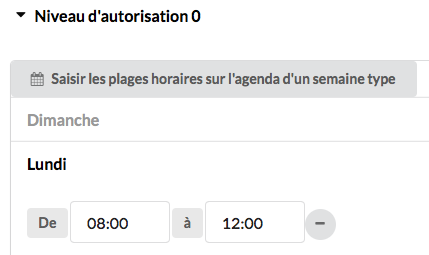

## Motifs des rendez-vous

Il est possible de préparer des motifs de rendez-vous afin de ne pas avoir à les saisir manuellement pour chaque rendez-vous futur.

Il faut utiliser le bouton "+" pour créer un nouveau motif et ensuite, saisir son intitulé, son niveau d'autorisation (pour la prise de rendez-vous en ligne), sa durée par défaut (qui pourra bien entendu être modifiée lors de la prise d'un rendez-vous) et sa couleur :

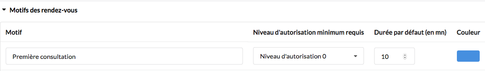

# Rappels par SMS

Ce menu permet au praticien de définir s'il souhaite ou non envoyer des rappels de SMS aux patients.
Pour activer l'option de rappels par SMS, il suffit de cocher la case "Emettre des rappels par SMS"

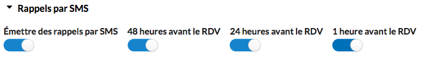

Une fois l'option activée, il faudra bien veiller à cocher les délais de rappels qui sont tous activés par défaut.
Ainsi, pour activer uniquement un rappel toutes les 48h, il ne faudra cocher que la case "48h avant le rendez-vous".
Exemple :

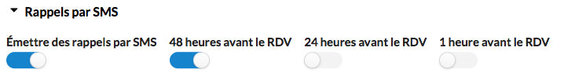

Il est ensuite possible de personnaliser les deux types de SMS envoyés aux patients :

1) Le SMS de confirmation initiale. C'est le SMS envoyé au patient lorsqu'il prend rendez-vous en ligne pour qu'il puisse le confirmer :

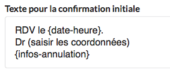

2) Le SMS de rappel, celui envoyé 48h, 24h ou 12h (selon le(s) choix effectué(s)) au patient pour lui rappeler son rendez-vous :

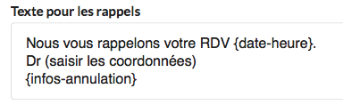

Dans ces deux zones de texte, tout ce qui est écrit entre les symboles {} sont des champs automatiques.
Par exemple, le champ {date-heure} retourne la date et l'heure du rendez-vous du patient, dans le SMS.
Il ne faut donc pas modifier ces types de champs.
Tout le reste par contre est modifiable.

