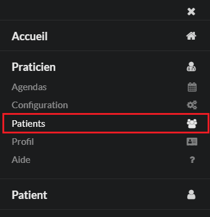
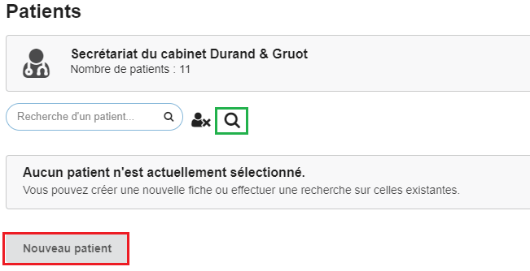
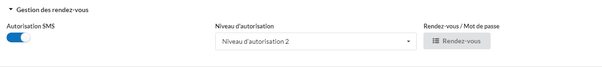
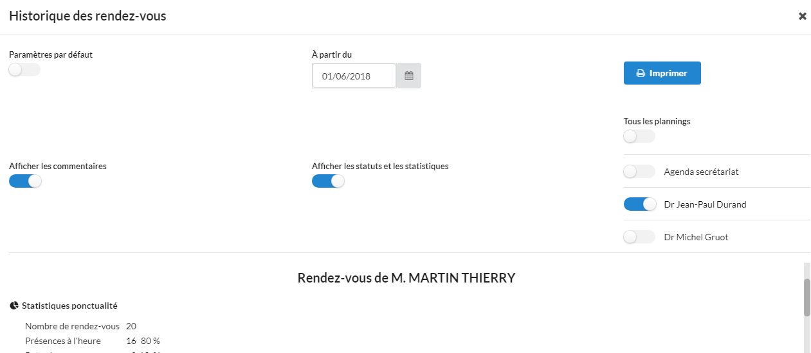

# PATIENTS

Le praticien accède aux fiches de ses patients.

Permet de créer, lire, mettre à jour ou supprimer une fiche d'un patient.

Création d'une nouvelle fiche : 

* Sur une fiche, les informations générales se trouvent dans la rubrique **Informations générales**. On y retrouve aussi l'identifiant du patient dans la base de données (préfixé par un "**_#_**").

* Les coordonnées du patient sont dans la rubrique **Adresse et contact**. Il faut noter qu'un numéro de téléphone portable du patient est nécessaire que le praticien puisse faire un rappel de rendez-vous par SMS.

## Gestion des rendez-vous

Dans cette rubrique, le praticien pourra affecter au patient un niveau d'autorisation pour la prise de rendez-vous en ligne, autoriser/bloquer les rappels de rendez-vous par SMS et acceder aux autres services.

Le praticien accédera aux autres services via le bouton "**Rendez-vous**".

* Confirmation de Rendez-vous par SMS
* Impression de la liste des prochains rendez-vous sur une carte
* Historique des rendez-vous du patient
* Génération d'un nouveau mot de passe pour le patient

Une aide pour l'impression d'une carte de rendez-vous est fournie pour les navigateurs **_Google Chrome_**, **_Mozilla Firefox_**, **_Microsoft Edge_** et **_Safari_**. 

Options d'impréssion de l'historique des rendez-vous : 

