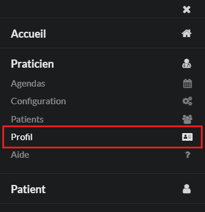
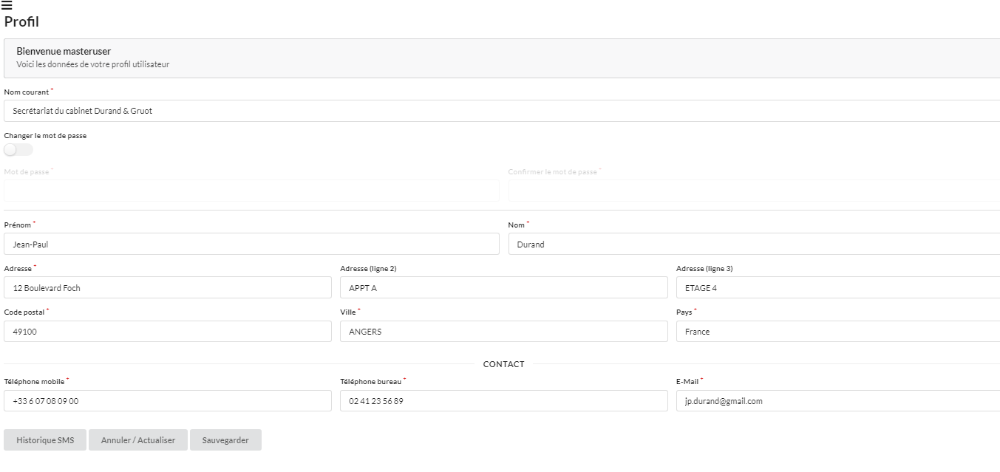

# PROFIL

Permet au praticien de saisir toutes ses coordonnées administratives et de changer son mot de passe s'il le souhaite.

Pour modifier le mot de passe, il suffit de cocher la case "Changer le mot de passe", choisir un nouveau mot de passe puis, le confirmer.
Cliquer ensuite sur "Sauvegarder", en bas de page, pour valider le changement.

Le praticien peut aussi y consulter son **historique des sms**.

